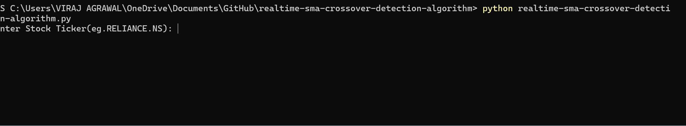

# realtime-sma-crossover-detection-algorithm
I built a real-time stock analysis tool that streams live data, computes SMA indicators, detects bullish/bearish crossovers, and updates a live chart with visual and audio alerts. Features multi-interval analysis, timezone handling, and robust intraday data processing.

## Features:

1. Live data streaming using Yahoo Finance

2. Multi-timeframe support: 1m, 5m, 1d, 1mo

3. Dynamic moving averages: user-selectable (e.g., 5-DMA, 20-DMA)

4. Automatic crossover detection

5. Bullish crossover → Buy signal

6. Bearish crossover → Sell signal

7. Audio alerts when a crossover occurs

8. Live chart that updates every minute

9. Vertical markers showing crossover points

10. Timezone handling (Asia/Kolkata)

11. Intraday filtering for accurate 9:15–15:30 market hours

12. User friendly CLI output

## How It Works:

  1. Fetches the latest market data from Yahoo Finance

  2. Computes rolling moving averages in real time

  3. Compares previous vs. current SMA values to detect crossings

  4. Updates a live Matplotlib chart every 60 seconds

  5. Audio and Visual alert when a crossover occurs

  6. Refreshes the console display with the latest analysis

## USAGE

1. Create and activate a virtual environment.
   
2. Install dependencies: `pip install -r requirements.txt`
   
3. Run: `python realtime_sma_analyzer.py`

### Example Input

## Example Output
### Console (Real-Time Updates):
FOR 5 MIN:

FOR 1 MONTH:

### Live Chart Example

Price + 5-DMA + 20-DMA with crossover markers.

FOR 1 MIN INTERVAL:

FOR 5 MIN INTERVAL:

FOR 1 DAY INTERVAL:

FOR 1 MONTH INTERVAL:

## ALGORITHM:

## LICENSE:

  This project is licensed under the MIT License.
